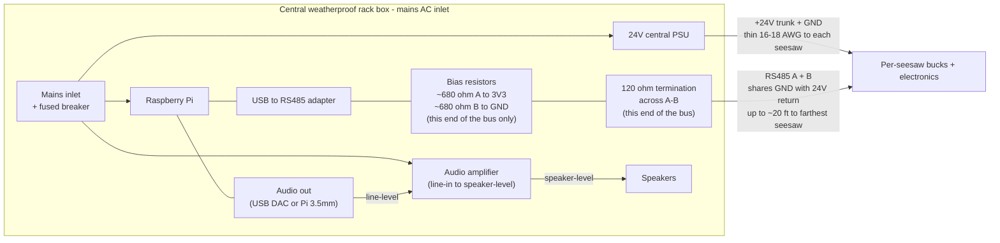

# Audio player (Raspberry Pi)

Polyphonic audio player that listens on RS485 for events from the seesaws and plays the sound mapped to each `(seesaw_id, direction)`. New events never cut off in-flight sounds. Adding a seesaw is one entry in `config.yaml` - no code changes.

The seesaws also emit IDLE/PLAY state-change events on every transition. The player has a [listener stub](#state-change-events-idleplay) for them today (they're logged but not acted on); idle-aware audio behavior can be hooked in there later without any firmware change.

See the [root README](../README.md) for system architecture and wiring.

## Layout

- [seesaw_audio.py](seesaw_audio.py) - main script
- [config.yaml](config.yaml) - serial port, audio settings, per-seesaw sound map
- [requirements.txt](requirements.txt) - Python deps
- [seesaw-audio.service](seesaw-audio.service) - optional systemd unit
- [sounds/](sounds/) - drop your WAV files here

## Hardware

A USB-to-RS485 adapter plugged into any of the Pi's USB ports. Avoid the Pi's GPIO UART for this - level mismatch (Pi GPIO is 3.3 V, classic MAX485 boards are 5 V) and Bluetooth UART contention make it more trouble than it's worth.

### What lives at the central rack



Everything mains-fed lives in this rack box: the 24 V PSU that powers the seesaws, the Raspberry Pi, and the audio amplifier. The only electronics outside this box are the seesaws themselves (Teensy, transceiver, level shifter, LED strips) and a small 24V→5V buck converter inside an IP65 junction box on each seesaw - all powered from the rack's 24 V trunk and signaled by the rack's RS485 line.

The other end of the RS485 bus (at the seesaw farthest from the rack) needs its own 120 ohm termination resistor. **Bias resistors go at the rack end only**, never at both ends.

### Amplifier choices

Two practical setups; pick whichever fits your venue:

- **Passive speakers + dedicated amp**: a small Class D board (TPA3116-based 50 W stereo amps are ~$15-25; Adafruit MAX9744 20 W stereo is a tidy ready-made option) driven from the Pi's 3.5 mm jack or a USB DAC. Cleanest signal path, easiest to size to the speakers.
- **Powered speakers / PA**: skip the discrete amp and feed line-level straight into a self-powered speaker or a small PA system. One fewer box at the rack, but you're locked into whatever the speaker's amp does.

The audio player itself does not care which path you choose - `pygame.mixer` outputs whatever the OS audio device produces. If you're using a USB DAC, set its name as a substring in `audio.device` in `config.yaml`.

The other end of the RS485 bus (at the seesaw cluster) needs its own 120 ohm termination resistor. **Bias resistors go at this end only**, never at both.

### Finding the serial device

After plugging in, find the device:

```bash
dmesg | tail               # watch the kernel name your adapter
ls -l /dev/serial/by-id/   # stable per-device path
```

You'll see something like `/dev/ttyUSB0`. Use that in `config.yaml`. For a stable name across reboots when other USB serial devices are present, add a udev rule:

```bash
# /etc/udev/rules.d/99-seesaws.rules
SUBSYSTEM=="tty", ATTRS{idVendor}=="<vid>", ATTRS{idProduct}=="<pid>", SYMLINK+="ttyRS485"
```

Get `<vid>`/`<pid>` from `lsusb`. Then `serial.port: /dev/ttyRS485`.

## Python setup

The Pi must have system-level audio output already working (test with `aplay /usr/share/sounds/alsa/Front_Center.wav`). Then create a venv and install deps:

```bash
cd /home/pi/Seesaws/Audio
python3 -m venv .venv
source .venv/bin/activate
pip install -r requirements.txt
```

Dependencies:

- `pyserial` - serial port I/O
- `pygame` - the actual audio mixer (SDL_mixer under the hood, polyphonic)
- `PyYAML` - config parsing

Pygame on Raspberry Pi OS may need a few SDL system packages already installed by default; if `pip install pygame` complains, run `sudo apt install python3-pygame` once or `sudo apt install libsdl2-mixer-2.0-0`.

## Configuration (`config.yaml`)

```yaml
serial:
  port: /dev/ttyUSB0     # or /dev/ttyRS485 with the udev rule above
  baud: 115200           # must match RS485_BAUD in firmware

audio:
  frequency: 44100
  buffer: 512            # smaller = lower latency, larger = fewer underruns
  channels: 32           # max simultaneous overlapping sounds
  # device: "USB Audio"  # optional: substring match for a specific output

sounds:
  1:
    A: sounds/seesaw1_A.wav
    B: sounds/seesaw1_B.wav
  2:
    A: sounds/seesaw2_A.wav
    B: sounds/seesaw2_B.wav
```

Rules:

- The numeric key under `sounds:` is the firmware's `SEESAW_ID`.
- Direction keys must be `A` or `B` and correspond to `DIR_A` / `DIR_B` in the firmware.
- Paths are resolved relative to `config.yaml` unless absolute.
- Adding a new seesaw means adding one new entry. The script does not need to be restarted unless you change the running configuration; restart on changes.

### Sound asset guidance

- **Format**: 44.1 kHz 16-bit WAV is fastest to load and lowest latency. MP3/OGG also work.
- **Length**: any length. The mixer is polyphonic, so a long sound and a short one will overlap correctly.
- **Avoid clicks**: ensure the WAV starts and ends at zero crossings. Many DAWs have a "fade-in/out 5 ms" macro for this.
- **Normalize** all sounds to roughly the same loudness to avoid surprises during installation tuning.

## State-change events (IDLE/PLAY)

The seesaws send two kinds of frames over RS485:

| Byte 3 | Constant | Source | Handler |
|---|---|---|---|
| 0 | `EVT_TILT_A` (= `DIR_A`) | tilt: SIDE_A bottomed out | `play()` |
| 1 | `EVT_TILT_B` (= `DIR_B`) | tilt: SIDE_B bottomed out | `play()` |
| 2 | `EVT_STATE_IDLE` | seesaw entered IDLE | `on_state_change()` (stub) |
| 3 | `EVT_STATE_PLAY` | seesaw entered PLAY | `on_state_change()` (stub) |

Tilt events drive sound playback (existing behavior). State-change events are emitted by the firmware on every IDLE<->PLAY transition - boot lands in IDLE, the first tilt out of IDLE flips to PLAY, and after `IDLE_TIMEOUT_MS` (default 60 s) without activity the seesaw drops back to IDLE.

The player currently has a no-op listener for state events:

```python
def on_state_change(self, sid: int, event: int, seq: int) -> None:
    name = EVENT_NAMES.get(event, f"0x{event:02X}")
    LOG.info("State change: seesaw %d -> %s (seq %d)", sid, name, seq)
```

It just logs at INFO level so you can see state changes scroll by while you bench-test the firmware:

```
State change: seesaw 1 -> STATE_IDLE (seq 0)
State change: seesaw 1 -> STATE_PLAY (seq 17)
Playing seesaw 1 A
...
State change: seesaw 1 -> STATE_IDLE (seq 42)
```

When you want the audio side to actually react to idle/play (attract music between sessions, ducking, etc.), edit `on_state_change` in `seesaw_audio.py`. The dispatcher in `run()` already routes `EVT_STATE_*` to it; the firmware already emits the events. No firmware change needed.

There is no per-seesaw config for state events - the listener is global. If you later want different idle behavior per seesaw, key on `sid` inside `on_state_change`.

## Running manually (recommended for first start)

```bash
cd /home/pi/Seesaws/Audio
source .venv/bin/activate
python seesaw_audio.py
```

You should see:

```
Audio ready: 44100 Hz, buffer=512, 32 voices
Loaded seesaw 1 A -> seesaw1_A.wav
Loaded seesaw 1 B -> seesaw1_B.wav
...
Serial open: /dev/ttyUSB0 @ 115200 baud
Listening for events. Press Ctrl-C to stop.
```

Then tilt a seesaw - you should see `Playing seesaw 1 A` (or whichever direction) and hear the sound. `Ctrl-C` shuts down cleanly.

Add `-v` for debug logging including dedup events and per-frame parsing detail:

```bash
python seesaw_audio.py -v
```

## Running as a systemd service (autostart on boot)

The shipped unit assumes the repo lives at `/home/pi/Seesaws/` with the venv at `Audio/.venv/`. Adjust paths if yours differ.

```bash
sudo cp /home/pi/Seesaws/Audio/seesaw-audio.service /etc/systemd/system/
sudo systemctl daemon-reload
sudo systemctl enable seesaw-audio.service
sudo systemctl start seesaw-audio.service

# verify
systemctl status seesaw-audio.service
journalctl -u seesaw-audio.service -f
```

`Restart=on-failure` brings it back if it crashes; `RestartSec=5` gives the system five seconds between attempts.

## Troubleshooting

- **No sound at all** -> confirm `aplay` works first, then check `audio.device` in config. Without it, pygame uses the default ALSA device. To force a specific output device, find its name with `aplay -L` and put a substring in `audio.device`.
- **`Sound file missing`** -> path in `config.yaml` is relative to the YAML file itself, not your shell's CWD. Either keep WAVs in `sounds/` or use absolute paths.
- **`No free channel`** -> raise `audio.channels` (try 64). Means more sounds were overlapping than the mixer was configured for.
- **`CRC mismatch` warnings** -> bus integrity issue. Usual suspects: missing termination at one end, missing bias resistors, swapped A/B somewhere, or `serial.baud` not matching the firmware's `RS485_BAUD`.
- **Garbled output / `No sound mapped for seesaw N direction X` for an N you didn't plan for** -> typically random noise on a poorly-terminated bus passing CRC by chance. Fix bus wiring and the spurious events stop.
- **`Unknown event code 0x..` warnings** -> same root cause as garbled CRC-passing noise above. The firmware only ever sends event codes 0..3; anything else on a bench setup means bus integrity is the problem, not the firmware.
- **Latency feels high** -> reduce `audio.buffer` (256 or 128). Trade-off: smaller buffers underrun more easily on a busy Pi.
