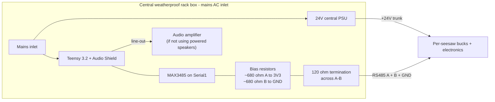

# Audio node (Teensy 3.2 + Audio Shield)

Polyphonic audio player that listens on RS485 for tilt events from the seesaws and plays WAV files from the Audio Shield SD card. Multiple sounds overlap freely — new tilts never cut off sounds already playing.

Sound files are named by **seesaw ID** and **direction**. When seesaw `N` triggers side A, the player looks for `sounds/N_A.wav` on the SD card; side B plays `sounds/N_B.wav`. The number in the filename must match the `SEESAW_ID` flashed into that seesaw's firmware. Adding a seesaw is just copying two WAV files onto the card — no config file and no code change.

The seesaws also emit IDLE/PLAY state-change events. The audio sketch logs them on USB Serial today ([listener stub](#state-change-events-idleplay)); idle-aware behavior can be hooked in later without firmware changes on the seesaws.

See the [root README](../README.md) for system architecture and wiring.

## Layout

- [SeesawAudio/](SeesawAudio/) — Arduino sketch (`SeesawAudio.ino`, `config.h`, `protocol.h`)
- [sounds/](sounds/) — source WAVs to copy onto the SD card (not read from the repo at runtime)

## Hardware

- **Teensy 3.2** + **PJRC Audio Shield** (Rev B or later)
- **MAX3485** or **SN65HVD3082** on **Serial1** (RX pin 0, TX pin 1, DE+RE on pin 2 — same pinout as the seesaw firmware)
- **microSD card** in the Audio Shield (FAT32, copy the `sounds/` folder to the card root)
- Line-out or headphone jack on the shield → your rack amplifier or powered speakers

Do **not** wire RS485 to Serial2 (pins 7/8) — those pins are used by the Audio Shield.

### What lives at the central rack

```mermaid
flowchart LR
    subgraph rack [Central weatherproof rack box - mains AC inlet]
        Mains["Mains inlet"]
        PSU24["24V central PSU"]
        TAudio["Teensy 3.2 + Audio Shield"]
        Amp["Audio amplifier<br/>(if not using powered speakers)"]
        XCVR["MAX3485 on Serial1"]
        Bias["Bias resistors<br/>~680 ohm A to 3V3<br/>~680 ohm B to GND"]
        Term["120 ohm termination<br/>across A-B"]
        Mains --> PSU24
        Mains --> TAudio
        TAudio -->|"line-out"| Amp
        TAudio --- XCVR
        XCVR --- Bias --- Term
    end
    PSU24 -->|"+24V trunk"| Field["Per-seesaw bucks + electronics"]
    Term -->|"RS485 A + B + GND"| Field
```

The other end of the RS485 bus (farthest seesaw) needs its own 120 Ω termination. **Bias resistors go at this rack end only**, never at both ends.

Power the Teensy from the rack's 5 V supply (USB VIN with `VIN`/`VUSB` cut if you also use USB for bench programming) or a dedicated 5 V buck off the 24 V trunk.

## Sound file naming

Files live in folder `sounds/` on the SD card (matches `SOUNDS_DIR` in [config.h](SeesawAudio/config.h)):

| Seesaw `SEESAW_ID` | Tilt event | Filename |
|---|---|---|
| 1 | SIDE_A (`EVT_TILT_A`, wire code 0) | `sounds/1_A.wav` |
| 1 | SIDE_B (`EVT_TILT_B`, wire code 1) | `sounds/1_B.wav` |
| 2 | SIDE_A | `sounds/2_A.wav` |
| 2 | SIDE_B | `sounds/2_B.wav` |

Rules:

- The number before `_A` / `_B` **must** equal the triggering seesaw's `SEESAW_ID` in [Firmware/Seesaw/config.h](../Firmware/Seesaw/config.h).
- Direction letter is `A` or `B` (matches `DIR_A` / `DIR_B` on the wire).
- **Format**: 44.1 kHz 16-bit mono or stereo WAV is recommended (what the Audio library expects).
- **Length**: any length; voices are polyphonic.
- **Avoid clicks**: start/end at zero crossings or add short fades in your DAW.

Copy the repo's [sounds/](sounds/) directory to the **root** of the microSD so the card contains `sounds/1_A.wav`, etc.

## Teensyduino setup

1. Install [Arduino IDE](https://www.arduino.cc/en/software) and [Teensyduino](https://www.pjrc.com/teensy/td_download.html).
2. **Tools → Board → Teensyduino → Teensy 3.2**.
3. Install the **Audio** library via **Sketch → Include Library → Manage Libraries** if it is not already bundled with Teensyduino.
4. Open [SeesawAudio/SeesawAudio.ino](SeesawAudio/SeesawAudio.ino).
5. Prepare the SD card (copy `sounds/` onto it), insert into the shield.
6. **Upload**. Open **Tools → Audio System Design Tool** if you need to inspect the mixer graph (optional).

On first boot, USB Serial (115200 baud) prints SD status and each `Playing sounds/N_X.wav` line when a seesaw tilts.

### Tuning ([config.h](SeesawAudio/config.h))

| Constant | Default | Purpose |
|---|---|---|
| `RS485_BAUD` | 115200 | Must match `RS485_BAUD` in seesaw firmware |
| `MAX_VOICES` | 8 | Simultaneous overlapping sounds |
| `AUDIO_MEMORY_BLOCKS` | 16 | Raise if you hear dropouts with many overlaps |
| `SOUNDS_DIR` | `"sounds"` | Folder on the SD card |

`MAX_VOICES` is wired to eight `AudioPlaySdWav` objects in the sketch; if you change it, extend the player/mixer graph in `SeesawAudio.ino` to match.

## State-change events (IDLE/PLAY)

| Byte 3 | Constant | Handler |
|---|---|---|
| 0 | `EVT_TILT_A` | `playTilt()` → `sounds/{id}_A.wav` |
| 1 | `EVT_TILT_B` | `playTilt()` → `sounds/{id}_B.wav` |
| 2 | `EVT_STATE_IDLE` | `onStateChange()` (log only) |
| 3 | `EVT_STATE_PLAY` | `onStateChange()` (log only) |

To add idle-aware audio later, edit `onStateChange()` in `SeesawAudio.ino`. Tilt dispatch already calls `handleEvent()` for every valid frame.

## Troubleshooting

- **SD card init failed** — reseat the shield, format the card FAT32, confirm files are at `sounds/N_A.wav` not nested wrong.
- **Missing sound: sounds/N_X.wav** — filename ID does not match the seesaw's `SEESAW_ID`, or the file was not copied to the card.
- **No free voice** — more overlaps than `MAX_VOICES`; increase voices (and mixer wiring) or shorten WAVs.
- **CRC mismatch on Serial** — bus wiring: termination at both ends, bias at rack end only, `RS485_BAUD` matches firmware.
- **Dedup seesaw … seq …** — normal; firmware resends each event twice.
- **Distortion / dropouts** — raise `AUDIO_MEMORY_BLOCKS` or reduce `MAX_VOICES`.
