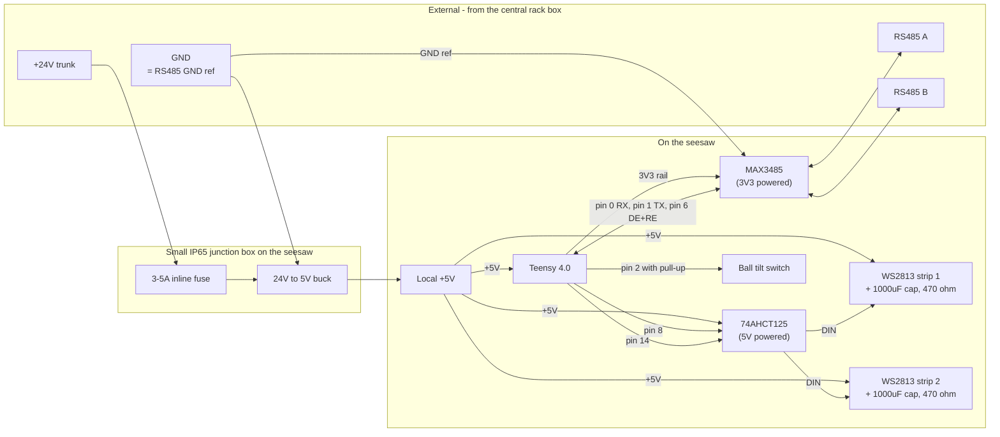

# Firmware (Teensy 4.0)

This is the per-seesaw Arduino sketch. Every seesaw runs identical code; only `SEESAW_ID` changes per flash. See the [root README](../README.md) for system architecture and wiring.

## Layout

- [Seesaw/Seesaw.ino](Seesaw/Seesaw.ino) - main sketch (`setup` + `loop`, tilt detection, chase playback, RS485 transmit)
- [Seesaw/config.h](Seesaw/config.h) - `SEESAW_ID`, FPS, pins, baud, debounce, retry settings
- [Seesaw/protocol.h](Seesaw/protocol.h) - 6-byte RS485 frame format and CRC-8
- [Seesaw/chase.h](Seesaw/chase.h) - paste-in chase animation data
- [tools/csv_to_header.py](tools/csv_to_header.py) - converts a chase CSV into `chase.h`

## Required tooling

1. **Arduino IDE 2.x** ([download](https://www.arduino.cc/en/software))
2. **Teensyduino** add-on ([install instructions](https://www.pjrc.com/teensy/td_download.html))
3. Board selected as **Tools -> Board -> Teensyduino -> Teensy 4.0**
4. **CPU speed**: default 600 MHz is fine
5. **Optimize**: "Faster" is fine

The only external library used is **`WS2812Serial`**, which is bundled with Teensyduino - no separate install. It's chosen over `Adafruit_NeoPixel` because it uses DMA and does **not** disable interrupts during writes, so RS485 RX bytes are never lost while the LEDs update.

## Pin map

| Function | Teensy 4.0 pin | Notes |
|---|---|---|
| Tilt switch | 2 (`PIN_TILT`) | INPUT_PULLUP, ball switch to GND |
| LED strip 1 data | 8 (`PIN_LED_STRIP_1`) | Through 74AHCT125 5V buffer + 470 ohm |
| LED strip 2 data | 14 (`PIN_LED_STRIP_2`) | Through 74AHCT125 5V buffer + 470 ohm |
| RS485 RX | 0 (`Serial1` RX) | from MAX3485 RO |
| RS485 TX | 1 (`Serial1` TX) | to MAX3485 DI |
| RS485 DE/RE | 6 (`PIN_RS485_DE`) | tied to MAX3485 DE+RE; toggled automatically |
| 5 V power in | VIN | from per-seesaw 24V to 5V buck output (cut VIN/VUSB pad if also using USB) |

`WS2812Serial` only works on Serial-TX-capable pins on Teensy 4.0: `1, 8, 14, 17, 20, 24, 29, 39`. Pin 1 is taken by `Serial1` (RS485), so we use 8 and 14. To change, pick any other two pins from that list and update `config.h`.

## On-seesaw block diagram

This is what physically lives on a single seesaw and how it connects to the two external buses (24V power and RS485 data). For the installation-level view see the [root README](../README.md#wiring).



A short way to read this:

- The **24 V trunk** comes from the central weatherproof rack box. A small inline fuse on the +24V tap protects the trunk if the local buck shorts.
- The **buck converter** (sized for this seesaw's worst-case 5 V draw) lives in a small IP65 junction box on the seesaw and produces clean local 5 V. It's the only piece of "outdoor" electronics that needs its own enclosure.
- The **local 5 V output** powers the LED strips, the level shifter, and the Teensy's `VIN`. The strips never see the trunk voltage, so trunk drop doesn't matter for color stability.
- The **Teensy's onboard 3V3 regulator** powers the MAX3485 transceiver and the tilt-switch pull-up. The transceiver only draws ~1 mA, well within the 3V3 rail's budget.
- The **74AHCT125** sits between the Teensy data pins and the strips so the WS2813s see clean 5 V edges.
- The **MAX3485** sits between the Teensy's `Serial1` and the RS485 bus. DE/RE is on pin 6 and is toggled automatically by `Serial1.transmitterEnable()`.
- The **GND wire on the RS485 cable, the 24 V return, and the buck's GND reference are all the same conductor** - one shared GND ties everything together.

## Per-seesaw configuration

Before flashing each board, edit [Seesaw/config.h](Seesaw/config.h):

```cpp
#define SEESAW_ID 1   // unique 1..255 across the bus
```

`SEESAW_ID` must match an entry in `Audio/config.yaml` on the Pi for any sound to play.

Other settings that you typically only set once for the whole installation:

| Constant | Default | Meaning |
|---|---|---|
| `CHASE_FPS` | 30 | Animation frame rate |
| `TILT_DEBOUNCE_MS` | 50 | Stable-read window before a tilt change is accepted |
| `RS485_BAUD` | 115200 | Must match `serial.baud` in the Pi config |
| `RS485_RESEND_COUNT` | 2 | Times each event is sent on the bus |
| `RS485_RESEND_JITTER_MIN_MS` / `_MAX_MS` | 5 / 25 | Random gap between resends |

## Chase data workflow

The chase is one animation. The sketch plays it **forward** for `SIDE_A` and **reverse** for `SIDE_B`, on both LED strips simultaneously. Same data, opposite playback direction.

### Option 1 - generate from CSV (recommended)

Author the animation in your tool of choice and export to CSV with one row per frame and `R,G,B,R,G,B,...` per LED. Then:

```bash
python Firmware/tools/csv_to_header.py path/to/chase.csv
```

That regenerates `Firmware/Seesaw/chase.h` with the correct `CHASE_NUM_LEDS` and `CHASE_NUM_FRAMES` and the data baked in. You can also point at any output path with `-o`.

CSV rules:

- One row per frame; all rows must have the same length.
- Length must be a multiple of 3; the LED count is auto-detected as `columns / 3`.
- Values are integers 0..255.
- Blank lines and lines starting with `#` are skipped.

Example for 4 LEDs, 3 frames (a red dot moving from LED 0 to LED 2):

```csv
# r0,g0,b0, r1,g1,b1, r2,g2,b2, r3,g3,b3
64,0,0, 0,0,0, 0,0,0, 0,0,0
0,0,0, 64,0,0, 0,0,0, 0,0,0
0,0,0, 0,0,0, 64,0,0, 0,0,0
```

### Option 2 - paste manually

Open `Firmware/Seesaw/chase.h`, set `CHASE_NUM_LEDS` and `CHASE_NUM_FRAMES`, then replace the rows between the `BEGIN CHASE DATA` / `END CHASE DATA` markers. Each row must be `{ r,g,b, r,g,b, ... }` with `CHASE_NUM_LEDS` triplets.

The placeholder shipped in the file is a single red pixel walking across 5 LEDs over 5 frames, which is a useful first sanity check on the bench - tilt the seesaw one way and the dot moves left to right; tilt the other way and it moves right to left.

### Memory note

`chase` lives in `PROGMEM` (Teensy 4.0 has 2 MB of flash). Storage cost is `CHASE_NUM_LEDS * 3 * CHASE_NUM_FRAMES` bytes - e.g. 100 LEDs at 5 s @ 30 FPS = 45 KB. Plenty of headroom.

## Build and flash

1. Open `Firmware/Seesaw/Seesaw.ino` in the Arduino IDE.
2. **Tools -> Board -> Teensy 4.0**.
3. **Tools -> Port -> (the Teensy)**, or just press the program button on the Teensy and let Teensyduino auto-detect.
4. Edit `SEESAW_ID` in `config.h` for the seesaw you're flashing.
5. Click **Upload**.

When you move to the next seesaw, change `SEESAW_ID` and upload again.

## Troubleshooting

- **LEDs work but show wrong colors** -> the strips might not be in `WS2811_GRB` order. WS2813 is normally GRB; if yours is RGB, change the `WS2812Serial` constructor in `Seesaw.ino` from `WS2811_GRB` to `WS2811_RGB`.
- **First LED stutters or wrong color, rest are fine** -> add the 1000 uF cap and 470 ohm resistor in series with data, and confirm common ground between the Teensy and strip PSU.
- **Tilt fires multiple times per real change** -> increase `TILT_DEBOUNCE_MS` (try 80-100 ms). Mechanical ball switches can chatter.
- **Pi never receives anything** -> confirm bus termination (120 ohm at both ends, **not** every node), bias resistors at the Pi end, and that A/B aren't swapped. The Teensy's onboard LED is not driven by this firmware so it is not a status indicator - watch the Pi log instead. You can use any USB-serial sniffer to read the bus directly to confirm bytes are coming out of the transceiver.
- **Pi receives garbage / CRC failures** -> baud mismatch, no bus termination, or A/B swapped on one node. Verify both ends of the cable.
