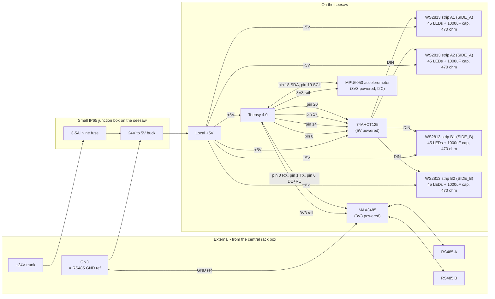
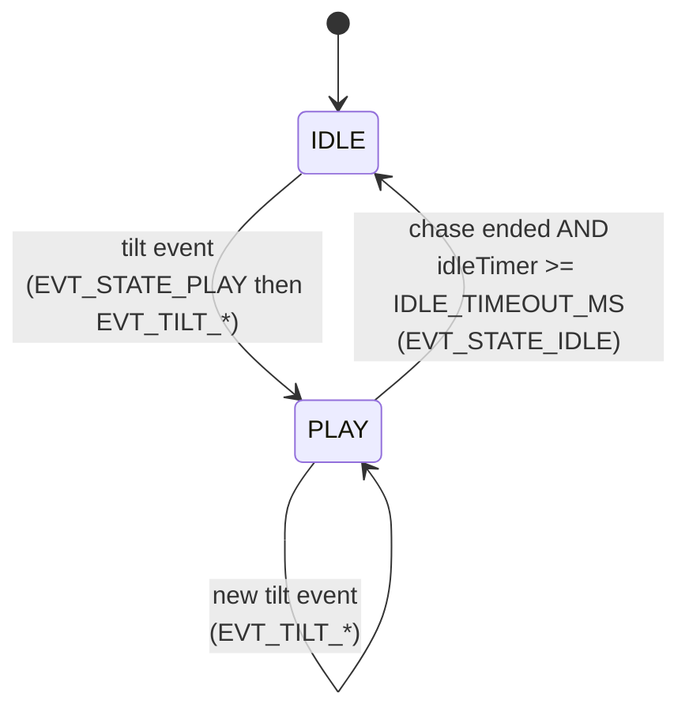

# Firmware (Teensy 4.0)

This is the per-seesaw Arduino sketch. Every seesaw runs identical code; only `SEESAW_ID` changes per flash. See the [root README](../README.md) for system architecture and wiring.

## Layout

- [Seesaw/Seesaw.ino](Seesaw/Seesaw.ino) - main sketch (`setup` + `loop`, tilt detection, idle/play state machine, chase + idle playback, RS485 transmit including state-change events)
- [Seesaw/config.h](Seesaw/config.h) - `SEESAW_ID`, FPS, pins, baud, tilt thresholds, idle timeout, idle frame offsets, retry settings
- [Seesaw/protocol.h](Seesaw/protocol.h) - 6-byte RS485 frame format and CRC-8 (defines tilt and state-change event codes)
- [Seesaw/chase.h](Seesaw/chase.h) - paste-in **play-mode** chase animation data
- [Seesaw/idle.h](Seesaw/idle.h) - paste-in **idle-mode** chase animation data (looped on all four strips when there's no recent activity)
- [tools/csv_to_header.py](tools/csv_to_header.py) - converts a play or idle CSV into `chase.h` / `idle.h`

## Required tooling

1. **Arduino IDE 2.x** ([download](https://www.arduino.cc/en/software))
2. **Teensyduino** add-on ([install instructions](https://www.pjrc.com/teensy/td_download.html))
3. Board selected as **Tools -> Board -> Teensyduino -> Teensy 4.0**
4. **CPU speed**: default 600 MHz is fine
5. **Optimize**: "Faster" is fine

External libraries (install once via **Arduino IDE -> Library Manager**):

- **`Adafruit MPU6050`** - MPU6050 driver
- **`Adafruit Unified Sensor`** - dependency of the above (the IDE will offer to pull it in automatically)
- (`Adafruit BusIO` may also be pulled in as a transitive dependency)

The MPU6050 replaces a mechanical tilt switch and is read in **gyroscope** mode: the firmware watches for direction reversals (the moment the seesaw bottoms out and starts coming back up) instead of crossing an absolute angle threshold. This makes triggers feel responsive at any amplitude, so a small kid rocking the seesaw a few degrees and an adult swinging through 30 degrees both fire events at the impact moment.

**`WS2812Serial`** is bundled with Teensyduino, no separate install. It's chosen over `Adafruit_NeoPixel` because it uses DMA and does **not** disable interrupts during writes, so RS485 RX bytes are never lost while the LEDs update. **`Wire`** is the standard Arduino I2C library and is also bundled.

## Pin map

| Function | Teensy 4.0 pin | Notes |
|---|---|---|
| MPU6050 SDA | 18 (default `Wire`) | to MPU6050 SDA pin |
| MPU6050 SCL | 19 (default `Wire`) | to MPU6050 SCL pin |
| MPU6050 VCC | 3V3 | most breakouts have an onboard regulator and accept either 3.3 V or 5 V; 3.3 V is safest |
| MPU6050 GND | GND | common ground |
| LED strip A1 data (SIDE_A pair) | 8 (`PIN_LED_STRIP_A1`) | Through 74AHCT125 5V buffer + 470 ohm |
| LED strip A2 data (SIDE_A pair) | 14 (`PIN_LED_STRIP_A2`) | Through 74AHCT125 5V buffer + 470 ohm |
| LED strip B1 data (SIDE_B pair) | 17 (`PIN_LED_STRIP_B1`) | Through 74AHCT125 5V buffer + 470 ohm |
| LED strip B2 data (SIDE_B pair) | 20 (`PIN_LED_STRIP_B2`) | Through 74AHCT125 5V buffer + 470 ohm |
| RS485 RX | 0 (`Serial1` RX) | from MAX3485 RO |
| RS485 TX | 1 (`Serial1` TX) | to MAX3485 DI |
| RS485 DE/RE | 6 (`PIN_RS485_DE`) | tied to MAX3485 DE+RE; toggled automatically |
| 5 V power in | VIN | from per-seesaw 24V to 5V buck output (cut VIN/VUSB pad if also using USB) |

`WS2812Serial` only works on Serial-TX-capable pins on Teensy 4.0: `1, 8, 14, 17, 20, 24, 29, 39`. Pin 1 is taken by `Serial1` (RS485), so we use 8 / 14 for the SIDE_A pair and 17 / 20 for the SIDE_B pair. Each pin drives its own physical strip. Only the pair on the side that bottomed out animates per event; the two pins in that pair receive identical data so the two strips on that side stay in lock-step, and the pair on the other side is held dark for the chase. To change pins, pick any other four pins from that list and update `config.h`.

The MPU6050's I2C pull-ups are already on the breakout board, so no external pull-up resistors are needed. If you ever stack a second I2C device on the same bus, leave only one set of pull-ups in circuit.

## On-seesaw block diagram

This is what physically lives on a single seesaw and how it connects to the two external buses (24V power and RS485 data). For the installation-level view see the [root README](../README.md#wiring).



A short way to read this:

- The **24 V trunk** comes from the central weatherproof rack box. A small inline fuse on the +24V tap protects the trunk if the local buck shorts.
- The **buck converter** (sized for this seesaw's worst-case 5 V draw) lives in a small IP65 junction box on the seesaw and produces clean local 5 V. It's the only piece of "outdoor" electronics that needs its own enclosure.
- The **local 5 V output** powers the LED strips, the level shifter, and the Teensy's `VIN`. The strips never see the trunk voltage, so trunk drop doesn't matter for color stability.
- The **Teensy's onboard 3V3 regulator** powers the MAX3485 transceiver and the MPU6050. Both draw a few mA combined, well within the 3V3 rail's budget.
- The **74AHCT125** sits between the Teensy data pins and the strips so the WS2813s see clean 5 V edges. It's a quad buffer, so a single chip handles all four LED data lines.
- The **MAX3485** sits between the Teensy's `Serial1` and the RS485 bus. DE/RE is on pin 6 and is toggled automatically by `Serial1.transmitterEnable()`.
- The **GND wire on the RS485 cable, the 24 V return, and the buck's GND reference are all the same conductor** - one shared GND ties everything together.

## Per-seesaw configuration

Before flashing each board, edit [Seesaw/config.h](Seesaw/config.h):

```cpp
#define SEESAW_ID 1   // unique 1..255 across the bus
```

`SEESAW_ID` must match an entry in `Audio/config.yaml` on the Pi for any sound to play.

Other settings that you typically only set once for the whole installation:

| Constant | Default | Meaning |
|---|---|---|
| `STRIP_NUM_LEDS` | 45 | LEDs per physical WS2813 strip. All four strips are this length. Must be `>=` `CHASE_NUM_LEDS` and `IDLE_NUM_LEDS` |
| `CHASE_FPS` | 30 | Play-mode chase frame rate |
| `IDLE_FPS` | 15 | Idle-mode animation frame rate (independent of `CHASE_FPS`) |
| `IDLE_TIMEOUT_MS` | 60000 | Time without a tilt event before the seesaw drops back from PLAY to IDLE |
| `IDLE_FRAME_OFFSET_A1/A2/B1/B2` | `0`, `N/4`, `N/2`, `3N/4` of `IDLE_NUM_FRAMES` | Per-strip frame offsets for the idle wave. Set both pins on a side to the same value if you want that side's pair to stay in lock-step |
| `TILT_GYRO_AXIS` | `TILT_GYRO_AXIS_Y` | Which MPU6050 gyro axis is the seesaw's *rotation* axis (perpendicular to length, see below) |
| `TILT_INVERT` | `false` | Flip the sign if your mounting gives positive velocity for SIDE_A motion |
| `TILT_MIN_VELOCITY_DPS` | `15.0f` | Minimum angular velocity (deg/s) before motion is counted as real |
| `TILT_EVENT_COOLDOWN_MS` | 150 | Suppress further events for this long after firing one |
| `TILT_SAMPLE_INTERVAL_MS` | 10 | Gyro poll period (100 Hz) |
| `MPU_I2C_ADDR` | 0x68 | 0x68 default; 0x69 if you've tied AD0 high |
| `RS485_BAUD` | 115200 | Must match `serial.baud` in the Pi config |
| `RS485_RESEND_COUNT` | 2 | Times each event is sent on the bus |
| `RS485_RESEND_JITTER_MIN_MS` / `_MAX_MS` | 5 / 25 | Random gap between resends |

## MPU6050 mounting and axis selection

The MPU6050's gyroscope reports angular velocity around three axes (X, Y, Z). For a seesaw, only one of those three axes carries the rocking motion - the **rotation axis** the seesaw pivots around, which is typically perpendicular to the seesaw's length.

```text
Seesaw in profile, MPU6050 mounted flat with X along the length:

                  rocking motion
                       (^)
                        |
              SIDE_A down|  ___level___ |SIDE_B down
                 \      __\______/__   /
                   \   / __________\__/
                     \/____pivot___/
                      |  ^         |
                      |  | rotation axis = Y
                      |  | (perpendicular to length, horizontal)
                      o--o-->  X (along length)
                         |
                         v Z (vertical)

  When side A goes down: gyro Y reads negative deg/s
  When side B goes down: gyro Y reads positive deg/s
  When still:            gyro Y reads ~0 dps
```

### Pick the right axis at install time

1. Mount the MPU6050 anywhere on the seesaw - on the frame, the deck, inside an enclosure - with one of its axes aligned along the seesaw's length. The other two axes can be in any orientation as long as the breakout is rigidly attached to the seesaw.
2. Tilt the seesaw and watch which gyro axis reads nonzero. That's your `TILT_GYRO_AXIS`. (Easiest: temporarily add `Serial.printf("x=%.1f y=%.1f z=%.1f\n", g.gyro.x*57.3, g.gyro.y*57.3, g.gyro.z*57.3);` inside `readGyroAxis()`, plug in USB, open the Serial Monitor, rock the seesaw, and see which axis lights up.)
3. Set `TILT_GYRO_AXIS` to `TILT_GYRO_AXIS_X`, `_Y`, or `_Z`.
4. Tilt the seesaw toward your intended `SIDE_A` and watch the sign of that axis. If positive velocity comes out for SIDE_A motion, set `TILT_INVERT = true`. Otherwise leave it `false`.
5. Tune `TILT_MIN_VELOCITY_DPS` to taste:
   - **Lower** (5-10 dps) if you want the system to fire even at very gentle rocking. Risk: vibrations may register.
   - **Higher** (20-30 dps) if you only want firm rocks to count. Risk: a small child's gentle motion may not trigger.
6. Tune `TILT_EVENT_COOLDOWN_MS` if vigorous rocking is restarting the chase too aggressively (raise it) or if you want every individual reversal to retrigger (lower it, even to 50 ms).

### Why reversal-based detection (instead of an angle threshold)

An angle-threshold approach has a problem: someone rocking the seesaw through a small range never crosses the threshold and never sees any feedback. The system feels broken to that user even though it's working as designed.

Reversal detection sidesteps the issue. Every time the seesaw bottoms out and starts coming back up, an event fires - regardless of how high it went. A small swing and a big swing both register at the impact moment.

A small velocity dead zone around zero (`TILT_MIN_VELOCITY_DPS`) means gyro noise can't fake a reversal when the seesaw is sitting still. The cooldown prevents a fast double-bounce from re-triggering before the chase has a chance to play.

## Idle / Play state machine

The firmware runs in one of two modes at any time:

- **PLAY**: triggered by a tilt event. The play chase in `chase.h` runs **forward on the SIDE_A pair** for `DIR_A` and **reverse on the SIDE_B pair** for `DIR_B`. The pair on the non-triggered side stays dark, so feedback is localized to whichever side just hit the ground. A new tilt event (after the cooldown) interrupts the in-progress chase and may swap which pair is lit.
- **IDLE**: the seesaw boots into this mode and falls back to it after `IDLE_TIMEOUT_MS` (default 60 s) without a tilt event. The idle animation in `idle.h` plays continuously on **all four strips at once**, with each strip offset by `IDLE_FRAME_OFFSET_<strip>` frames so the strips animate phase-shifted (a wave across the seesaw).



Notes:

- The transition from PLAY back to IDLE only fires once the active chase has finished playing - the system never yanks an in-progress chase to switch modes.
- `idleTimer` resets to zero on every tilt event, regardless of current state. So holding the seesaw in active use indefinitely keeps it in PLAY; releasing it for `IDLE_TIMEOUT_MS` returns to IDLE.
- Setting `IDLE_TIMEOUT_MS` very low (e.g. 1000) makes the idle animation start only ~1 s after each play chase - useful while authoring an idle animation. Setting it very high (e.g. 86400000 = 24 h) effectively disables the idle mode in normal use.
- Every state transition emits a state-change event on RS485 (`EVT_STATE_IDLE` = wire byte 3 value `2`, `EVT_STATE_PLAY` = `3`), including the boot-into-IDLE transition. On the IDLE -> PLAY transition the state event goes out *before* the tilt event that caused it. The Pi audio player has a no-op listener stub for these (see [Audio/README.md](../Audio/README.md#state-change-events-idleplay)) so today they only get logged, but the wire path is in place for idle-aware audio behavior later without another firmware change.

## Animation data workflow (chase + idle)

There are two animation files in `Firmware/Seesaw/`: `chase.h` for the play chase and `idle.h` for the idle animation. Both have the same on-disk layout and are produced by the same `csv_to_header.py` tool.

The play chase in `chase.h` is one animation: the sketch plays it forward on the SIDE_A pair when SIDE_A bottoms out, and in reverse on the SIDE_B pair when SIDE_B bottoms out (only the triggered side lights up).

The idle animation in `idle.h` is also one animation, played simultaneously on all four strips when the seesaw is idle. Each strip is offset by `IDLE_FRAME_OFFSET_<strip>` frames (set in `config.h`) so the strips animate phase-shifted; the animation loops indefinitely until a tilt event drops it.

### Option 1 - generate from CSV (recommended)

Author each animation in your tool of choice and export to CSV with one row per frame and `R,G,B,R,G,B,...` per LED. Then run the tool with the matching `--target`:

```bash
# Play chase -> Firmware/Seesaw/chase.h
python Firmware/tools/csv_to_header.py path/to/chase.csv

# Idle animation -> Firmware/Seesaw/idle.h
python Firmware/tools/csv_to_header.py path/to/idle.csv --target idle
```

That regenerates the matching header (`chase.h` or `idle.h`) with the correct `<PREFIX>_NUM_LEDS` and `<PREFIX>_NUM_FRAMES` and the data baked in. The tool prints which file it wrote and the PROGMEM size. Override the destination with `-o` if you need to.

CSV rules (same for both targets):

- One row per frame; all rows must have the same length.
- Length must be a multiple of 3; the LED count is auto-detected as `columns / 3`.
- Values are integers 0..255.
- Blank lines and lines starting with `#` are skipped.

Example for 4 LEDs, 3 frames (a red dot moving from LED 0 to LED 2):

```csv
# r0,g0,b0, r1,g1,b1, r2,g2,b2, r3,g3,b3
64,0,0, 0,0,0, 0,0,0, 0,0,0
0,0,0, 64,0,0, 0,0,0, 0,0,0
0,0,0, 0,0,0, 64,0,0, 0,0,0
```

### Option 2 - paste manually

Open `Firmware/Seesaw/chase.h` (or `idle.h`), set `CHASE_NUM_LEDS` / `CHASE_NUM_FRAMES` (or `IDLE_NUM_LEDS` / `IDLE_NUM_FRAMES`), then replace the rows between the `BEGIN .. DATA` / `END .. DATA` markers. Each row must be `{ r,g,b, r,g,b, ... }` with `<PREFIX>_NUM_LEDS` triplets.

Both `CHASE_NUM_LEDS` and `IDLE_NUM_LEDS` must be `<=` `STRIP_NUM_LEDS` from `config.h`; `static_assert`s in `Seesaw.ino` enforce this. Any LEDs past the chosen width simply stay dark.

### Placeholder behavior

- `chase.h`: a single red pixel walking across 5 LEDs over 5 frames - a useful first sanity check on the bench. Tilt the seesaw one way and the dot moves left to right on the triggered side's pair; tilt the other way and it moves right to left on the other pair. With the default `STRIP_NUM_LEDS = 45`, only the first five LEDs of the active pair light up under this placeholder.
- `idle.h`: a slow red breath - all 5 LEDs ramp up and back down over 8 frames. With the default per-strip offsets in `config.h` (`0`, `2`, `4`, `6`), the four strips will breathe out of phase, so on the bench you see the wave effect immediately.

### Memory note

Both animations live in `PROGMEM` (Teensy 4.0 has 2 MB of flash). Storage cost is `<PREFIX>_NUM_LEDS * 3 * <PREFIX>_NUM_FRAMES` bytes per animation - e.g. 45 LEDs at 5 s @ 30 FPS = ~20 KB for the play chase, plus a similar bit for the idle. There is only one copy of each animation in flash; idle plays the same data on all four strips with index offsets, and the play chase plays the same data forward or reverse on whichever pair fired.

## Build and flash

1. Open `Firmware/Seesaw/Seesaw.ino` in the Arduino IDE.
2. **Tools -> Board -> Teensy 4.0**.
3. **Tools -> Port -> (the Teensy)**, or just press the program button on the Teensy and let Teensyduino auto-detect.
4. Edit `SEESAW_ID` in `config.h` for the seesaw you're flashing.
5. Click **Upload**.

When you move to the next seesaw, change `SEESAW_ID` and upload again.

## Troubleshooting

- **LEDs work but show wrong colors** -> the strips might not be in `WS2811_GRB` order. WS2813 is normally GRB; if yours is RGB, change the `WS2812Serial` constructor in `Seesaw.ino` from `WS2811_GRB` to `WS2811_RGB`.
- **First LED stutters or wrong color, rest are fine** -> add the 1000 uF cap and 470 ohm resistor in series with data, and confirm common ground between the Teensy and strip PSU.
- **No tilt events at all / boots silent** -> the MPU6050 might not be initialising. Confirm SDA/SCL aren't swapped, that the breakout is powered (3V3 + GND), and that `MPU_I2C_ADDR` matches your module (most are 0x68; some pull AD0 high and become 0x69). The firmware deliberately silences all events if `mpu.begin()` fails so a bad sensor doesn't flood the bus.
- **Tilt fires for the wrong direction** -> set `TILT_INVERT = true` in `config.h` (or the other way around).
- **Tilt fires for an unrelated motion (yaw / wobble)** -> wrong gyro axis. Print all three axes briefly (see the install-time procedure above), see which one carries the rocking, and update `TILT_GYRO_AXIS`.
- **Gentle rocking doesn't fire any events** -> motion never exceeds `TILT_MIN_VELOCITY_DPS`. Lower it (try 5-10 dps).
- **Tilt fires from random vibration / footsteps** -> raise `TILT_MIN_VELOCITY_DPS` (try 25-30 dps).
- **Chase keeps restarting on fast rocking** -> raise `TILT_EVENT_COOLDOWN_MS` (try 300-500 ms) so the chase has more time to play between events.
- **Latency feels too high between reversal and event** -> shorten `TILT_SAMPLE_INTERVAL_MS` (try 5 ms / 200 Hz). 100 Hz is already responsive; sub-10 ms latency is hard to perceive.
- **Pi never receives anything** -> confirm bus termination (120 ohm at both ends, **not** every node), bias resistors at the Pi end, and that A/B aren't swapped. The Teensy's onboard LED is not driven by this firmware so it is not a status indicator - watch the Pi log instead. You can use any USB-serial sniffer to read the bus directly to confirm bytes are coming out of the transceiver.
- **Pi receives garbage / CRC failures** -> baud mismatch, no bus termination, or A/B swapped on one node. Verify both ends of the cable.
