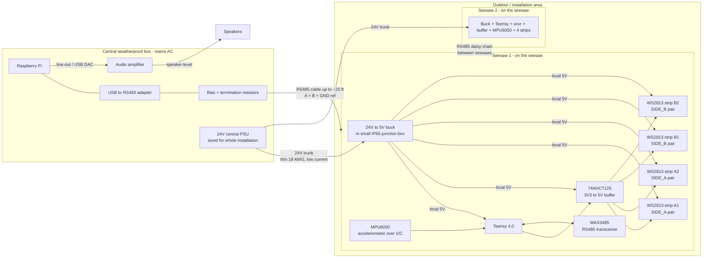
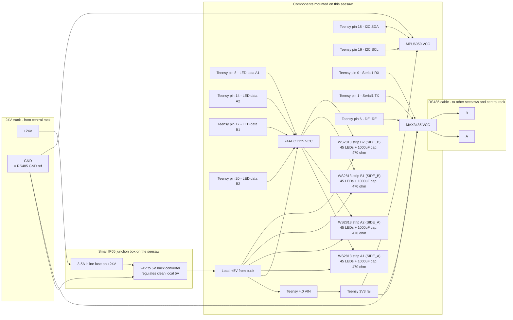
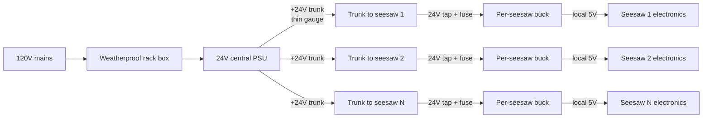

# Seesaws

Distributed control system for an interactive seesaw installation. Each seesaw has a **Teensy 4.0** that detects rocking with an **MPU6050** (firing events on direction reversal so triggers feel responsive at any amplitude - small kids and adults both register at the impact moment), plays a directional LED chase on the pair of WS2813 strips that lives on whichever side just bottomed out (four strips total, 45 LEDs each, two per side; only the triggered side lights up at a time), and broadcasts the event over an **RS485** bus to a central **Raspberry Pi** that plays a sound. Sounds are polyphonic - they overlap freely instead of cutting each other off.

The system is designed to scale to N seesaws with no architectural changes: every seesaw runs the same firmware, only the `SEESAW_ID` differs per flash, and adding a new seesaw on the Pi side is one entry in `config.yaml`.

## Physical layout - what lives where



Everything that's hard to weatherproof - the Pi, the amp, the big mains-fed PSU - stays inside the central weatherproof rack box. The only things outside that box are: the seesaws themselves, a tiny 24 V → 5 V buck converter inside a small IP65 junction box bolted to each seesaw, and the cable bundle running between them.

The cable bundle from the rack to each seesaw carries:

- 24 V trunk (low current, thin gauge) - the per-seesaw buck regenerates clean 5 V locally so trunk voltage drop is harmless
- RS485 differential pair (A, B)
- A single shared GND that doubles as the 24 V return AND the RS485 ground reference

## Repo layout

- [Firmware/](Firmware/) - Teensy 4.0 firmware. See [Firmware/README.md](Firmware/README.md).
  - [Seesaw/](Firmware/Seesaw/) - Arduino sketch
  - [tools/csv_to_header.py](Firmware/tools/csv_to_header.py) - converts a play or idle CSV into `chase.h` / `idle.h`
- [Audio/](Audio/) - Pi audio player (Python). See [Audio/README.md](Audio/README.md).

## Behavior

The firmware runs in one of two modes at any time:

- **IDLE** (default at boot, and re-entered automatically after `IDLE_TIMEOUT_MS` (default 60 s) without a tilt event): the idle animation in `idle.h` loops continuously on all four strips, with each strip offset by `IDLE_FRAME_OFFSET_<strip>` frames so they animate phase-shifted (a wave across the seesaw).
- **PLAY** (entered on the next tilt event): the play chase in `chase.h` runs on the pair of strips on the side that just bottomed out.

When the seesaw reverses direction (the moment one side bottoms out and starts coming back up):

1. The Teensy sends a 6-byte event frame over RS485 announcing `(SEESAW_ID, direction)` - `direction` is whichever side just bottomed out.
2. If the seesaw was in IDLE, it switches to PLAY (and the running idle animation is wiped). The Teensy then plays the chase animation on the **pair of strips that lives on the side that just bottomed out** - the SIDE_A pair runs the chase **forward** on `DIR_A`, the SIDE_B pair runs it in **reverse** on `DIR_B`. The other pair stays dark for the duration of the chase, so the visual feedback localizes to whichever side just hit the ground. The two pins in the active pair receive identical data so the two strips on that side stay in lock-step. A new tilt event interrupts the in-progress chase (and switches which pair is lit if the new event is on the opposite side), after a short configurable cooldown so very fast bounces don't re-stomp on the chase.
3. The Pi receives the frame, validates the CRC, dedupes against duplicate retransmits, and plays the WAV file mapped to `(seesaw_id, direction)` on a free `pygame.mixer` channel. It does not interrupt sounds already playing.

After `IDLE_TIMEOUT_MS` of no further tilt events, and only once the in-flight chase has finished, the seesaw drops back to IDLE.

The firmware also sends an **`EVT_STATE_*` frame** on every IDLE<->PLAY transition (boot lands in IDLE, the first tilt out of IDLE flips to PLAY, idle timeout drops back to IDLE). On an IDLE -> PLAY transition the state-change event goes out before the tilt event that caused it. The Pi has a no-op listener stub for these (they're logged but not acted on); idle-aware audio behavior - attract music between sessions, ducking, prompts - can be hooked in there later without any firmware change. See [Audio/README.md](Audio/README.md#state-change-events-idleplay) for the wire codes and the listener.

The Pi is a passive listener; seesaws never wait for an ack. Each event is sent twice on the bus with random jitter to mitigate the rare case of two seesaws tilting simultaneously and colliding on the wire.

## Hardware bill of materials

### Per seesaw (lives on each unit)
- 1x Teensy 4.0
- 1x **MPU6050 accelerometer breakout** (e.g. GY-521 module, ~$2-5). Mounted to the seesaw frame with one axis aligned along the seesaw's length.
- 1x **MAX3485** or **SN65HVD3082** (3.3 V RS485 transceiver - **do not use the 5 V MAX485 with Teensy 4.0**, its 3.3 V GPIO is not 5 V tolerant)
- 1x 74AHCT125 (or 74HCT245) 5 V level-shifting buffer for the LED data lines (the 74AHCT125 has four channels, exactly enough for the four LED strips)
- 4x WS2813 LED strips, **45 LEDs each**, two strips per side of the seesaw (`STRIP_NUM_LEDS` in `config.h`; if you change the length, change it on all four strips and update the constant)
- 4x 1000 uF electrolytic caps (one per strip, across V+/GND at the strip start)
- 4x 330-470 ohm resistors in series with each strip's data line (after the level shifter)
- 1x **24V to 5V buck converter** rated for the seesaw's worst-case 5V current with headroom (e.g. Pololu D24V90F5 5A, or a generic "DC-DC 24V to 5V 10A" board for higher LED counts)
- 1x small **IP65 / IP66 junction box with cable glands** to house the buck converter on or under the seesaw frame
- 1x 3-5A automotive / inline fuse on the seesaw's 24 V input tap (protects the central trunk if the local buck shorts)

### Central weatherproof rack box (one per installation)
- 1x **24 V central PSU** sized to the *whole installation's* worst-case load (sizing below). Examples: Mean Well **LRS-150-24** (6.5 A) for small installs, **LRS-350-24** (14.6 A) for larger
- 1x Raspberry Pi
- 1x USB-to-RS485 adapter (any common CH340/FT232+MAX485 dongle works)
- 1x 120 ohm termination resistor across A-B (this is one of the two bus terminations)
- 2x 680 ohm bias resistors at this end of the bus, one to 3V3 and one to GND
- 1x audio amplifier driven from the Pi's line-out or a USB DAC, sized to your speakers (e.g. TPA3116 / MAX9744 class-D for passive bookshelf speakers, or skip the amp entirely and use powered / PA speakers)
- 1x set of speakers (separate from the rack box; speaker cables exit the box)
- 1x mains inlet / fused breaker for the rack box

### Other / bus-wide
- 1x 120 ohm termination resistor at the *other* physical end of the RS485 bus (the seesaw farthest from the rack)
- 1x cable bundle from rack to each seesaw - simplest option is a single 4-conductor cable carrying `+24V`, `GND` (heavy-ish gauge, e.g. 18 AWG) and `A`, `B` (any thin gauge). Or a shielded cable if EMI is a concern.

## Wiring

### Component locations and signal flow per seesaw



Notes:

- **Cut the `VIN/VUSB` solder pad** on the underside of the Teensy 4.0 if you ever plug USB in while the rail is hot. Otherwise USB back-feeds the rail. Standard PJRC procedure for installations.
- **Do not** power the LED strips through the Teensy or its 3V3 regulator. Strips draw amps; they go straight to the buck output.
- The transceiver runs from the Teensy's 3V3 rail; the level shifter runs from the buck's 5V output. Keep all grounds common.
- The 24 V trunk's GND wire is also the RS485 ground reference - it carries return current for the buck *and* serves as the common-mode reference for the differential pair. Single GND wire from rack to seesaw.

### Power topology

A single 24 V central PSU lives in the same weatherproof rack box as the Pi and the amp. A thin two-conductor `+24V` / `GND` trunk runs out to each seesaw alongside the RS485 cable. At each seesaw, a small buck converter (mounted in its own little IP65 junction box) regenerates clean local 5 V for the strips, level shifter, and Teensy.



Why this works for an outdoor / weatherproof installation:

- **Everything mains-fed stays in the central rack box.** The big PSU, the Pi, the amp - all the items that are hardest to weatherproof and most expensive to replace - share one IP-rated enclosure.
- **The long run is low-current 24 V DC.** At 24 V, even 4 seesaws drawing peak current pull just ~6 A on the trunk; voltage drop over 20 ft of 18 AWG is ~6%, which the buck input range absorbs trivially. There is no risk of WS2813 brown-out from trunk voltage drop, because the strips never see the trunk - they see the buck's regulated 5 V output.
- **Per-seesaw bucks are easy to weatherproof.** A 24V→5V module is small (often credit-card-sized or smaller). It fits inside a $5 IP65 cable-gland junction box bolted under the seesaw. The buck is the only "wet" electronics outside the rack.

#### Sizing the central 24 V PSU

There are now two distinct lit-strip cases per seesaw, and the buck/PSU has to handle the higher of the two:

```text
PLAY mode: only ONE pair of strips lights at a time (the side that
just bottomed out), so peak draw is set by ONE pair (2 strips):
  I_play_5V = LEDs_per_strip * 2 strips * 60 mA
            ~= 5.4 A for the default 45 LEDs per strip
            ~= 7.2 A for 60 LEDs per strip
            ~=  12 A for 100 LEDs per strip

IDLE mode: ALL FOUR strips light continuously with the idle animation.
Peak depends on the brightness in idle.h - a subtle breath/wave at low
brightness is much cheaper than a hypothetical "all white" idle frame:
  I_idle_5V_worst = LEDs_per_strip * 4 strips * 60 mA * (idle_peak / 255)
                  ~= 2.7 A for the placeholder breath (peak ~64/255 ~= 25%)
                  ~= 10.8 A for 4 x 45 strips at 100% white in idle
  Author idle.h with this in mind: subtle slow patterns at moderate
  brightness draw far less than the play chase.

Per-seesaw 5V side: take the max of the two:
  I_seesaw_5V = max(I_play_5V, I_idle_5V_worst)

Per seesaw, 24V trunk side (buck efficiency ~90%):
  I_seesaw_24V ~= I_seesaw_5V * 5 / (24 * 0.9)
               ~= 1.25 A for the default 4 x 45 LED strips, play-bound
               ~= 1.7  A for 4 x 60 LED strips, play-bound
               ~= 2.8  A for 4 x 100 LED strips, play-bound

Central PSU: sum across all seesaws and add 30% headroom:
  I_PSU_24V = sum of I_seesaw_24V * 1.3
```

For the default config (4 x 45 LEDs, placeholder idle, default `LED_BRIGHTNESS = 255`), the play-mode peak (~5.4 A) dominates and the idle peak (~2.7 A) is comfortably under it - so the existing buck recommendations still apply. If you author a brighter idle animation, recompute `I_idle_5V_worst` from your idle.h's peak frame and re-pick the buck if it now exceeds the play case. `LED_BRIGHTNESS` in `config.h` scales both modes uniformly, so dropping it is the easiest way to cap power without re-rendering animations. Real animations rarely sit at full white, so average draw is much lower than peak - but size the PSU for peak so brief full-white frames don't brown out the rail.

#### Sizing the 24 V trunk wire

Voltage drop on the 24 V trunk is mostly cosmetic - the buck regenerates clean 5 V regardless. Aim to stay under ~5% drop at peak so the buck doesn't have to work hard:

| Wire | mΩ/ft | Drop at 5 A over 20 ft (round-trip) | Drop at 10 A over 20 ft |
|---|---|---|---|
| 18 AWG | 6.4 | 1.3 V (5%) | 2.6 V (11%) |
| 16 AWG | 4.0 | 0.8 V (3%) | 1.6 V (7%) |
| 14 AWG | 2.5 | 0.5 V (2%) | 1.0 V (4%) |

Rule of thumb: 18 AWG is fine for a single seesaw or two on the trunk; 14 or 16 AWG once you hit four-plus seesaws on a single 20 ft run. Star-wire from the rack (one trunk pair per seesaw) if you want each seesaw to see a clean 24 V. Daisy-chain the trunk if you don't.

#### Per-seesaw buck choices

Pick a buck whose continuous current rating is at least 1.5x your seesaw's worst-case 5 V draw:

- **Up to ~5 A** (default 4 x 45 LED strips, peak from ONE lit pair): Pololu D24V90F5 (5 A, ~$15) is on the edge - bump to a 7.5 A or 10 A module if you push `LED_BRIGHTNESS` to the maximum or stretch the strip length
- **5-10 A** (4 x 60 to 4 x 100 LED strips, peak from ONE lit pair): a generic "DC-DC 24V to 5V 10A" board (~$8-12), or a Mean Well DDR-15-5 / DDR-30L-5 DIN-rail module if you want industrial reliability

Mount the buck inside a small IP65 cable-gland junction box, with cable glands for the 24 V input wires (from the trunk) and the 5 V output wires (to the seesaw electronics). Heat dissipation on a 5-10 A buck inside a sealed plastic box is mild; if you're at the high end of the current range and the installation runs hot, a metal die-cast box doubles as a heatsink.

#### Other power topologies (if you ever need them)

- **IP-rated 5V PSU at the seesaw cluster (no buck)**: a Mean Well HLG-150-5 or similar mounted in its own outdoor enclosure at the cluster. Skip the buck. Run mains AC out to the cluster instead of 24V DC. Works if mains is already at the cluster and you'd rather have one outdoor PSU than N outdoor bucks.
- **Per-seesaw IP-rated 5V PSU**: one Mean Well HLG per seesaw. Most expensive, most failure-isolated, and requires running mains AC to every seesaw. Not recommended unless the install dictates it.

### LED data path (3.3 V to 5 V)

Teensy 4.0 outputs 3.3 V signals; WS2813 wants `VIH >= 3.5 V` when powered from 5 V. The 74AHCT125 buffer (powered from 5 V) takes the Teensy's 3.3 V outputs and produces clean 5 V edges at the strip data input.

```text
Teensy pin 8  -> 74AHCT125 input  -> 470 ohm -> Strip A1 DIN  (SIDE_A pair, 1000 uF cap at strip start)
Teensy pin 14 -> 74AHCT125 input  -> 470 ohm -> Strip A2 DIN  (SIDE_A pair, 1000 uF cap at strip start)
Teensy pin 17 -> 74AHCT125 input  -> 470 ohm -> Strip B1 DIN  (SIDE_B pair, 1000 uF cap at strip start)
Teensy pin 20 -> 74AHCT125 input  -> 470 ohm -> Strip B2 DIN  (SIDE_B pair, 1000 uF cap at strip start)
```

The 74AHCT125 has four buffer channels in one package, so a single chip handles all four LED data lines.

### RS485 bus

Run a 3-conductor cable between all nodes: A, B, and a GND reference wire. CAT5 with one twisted pair for A/B and one conductor for GND works perfectly.

- **Termination**: 120 ohm across A-B at both physical ends of the bus only.
- **Biasing**: ~680 ohm A-to-3V3 and ~680 ohm B-to-GND at exactly one node (usually the Pi end).
- **Ground reference**: the GND wire in the RS485 cable should tie to the cluster's 5V GND rail, so all transceivers share a common reference.
- **Adapter**: a USB-to-RS485 dongle on the Pi avoids the Pi's 3.3 V GPIO mismatch and Bluetooth UART contention. Recommended.
- **Transceiver wiring** (each Teensy):
  - MAX3485 VCC -> Teensy 3V3
  - MAX3485 GND -> common ground (cluster GND rail)
  - MAX3485 RO  -> Teensy pin 0 (Serial1 RX)
  - MAX3485 DI  -> Teensy pin 1 (Serial1 TX)
  - MAX3485 DE+RE tied together -> Teensy pin 6 (`PIN_RS485_DE`)
  - MAX3485 A/B -> bus A/B

`Serial1.transmitterEnable(PIN_RS485_DE)` toggles the DE/RE pin around every transmission automatically.

## Installation workflow

1. **Wire one seesaw** per the diagrams above. Power it up; the placeholder idle breath animation should run on all four strips immediately (boot lands directly in IDLE mode).
2. **Build animation data**. Author each animation in your tool of choice and export to CSV (one row per frame, R,G,B,R,G,B,... per LED, 0..255). Convert to headers:
   ```bash
   # Play chase -> Firmware/Seesaw/chase.h
   python Firmware/tools/csv_to_header.py path/to/chase.csv

   # Idle animation -> Firmware/Seesaw/idle.h
   python Firmware/tools/csv_to_header.py path/to/idle.csv --target idle
   ```
3. **Set the seesaw's ID** by editing `#define SEESAW_ID 1` in `Firmware/Seesaw/config.h`. Use `1` for the first seesaw, `2` for the second, etc.
4. **Flash** with the Arduino IDE + Teensyduino. See [Firmware/README.md](Firmware/README.md) for details.
5. **Verify both modes:**
   - **Idle**: at power-up, all four strips run the idle animation phase-shifted (a wave across the seesaw) and loop forever until you touch it.
   - **Play (Side A)**: tilt the seesaw so Side A bottoms out. The SIDE_A pair (both strips on Side A, in lock-step) runs the play chase forward; the SIDE_B pair stays dark.
   - **Play (Side B)**: tilt the other way. The SIDE_B pair runs the same chase in reverse and the SIDE_A pair goes dark.
   - **Idle return**: leave the seesaw alone for `IDLE_TIMEOUT_MS` (default 60 s). The idle animation should resume on all four strips.
6. **Repeat** steps 3-5 for each seesaw, incrementing the ID each time.
7. **Set up the Pi**: install the audio player and copy in your sound assets. See [Audio/README.md](Audio/README.md). Map every `(seesaw_id, direction)` to a WAV file in `Audio/config.yaml`.
8. **Wire the bus** with termination at both ends and biasing at the Pi end. Connect the USB-to-RS485 adapter to the Pi.
9. **Start the audio player** (manually first, then enable the systemd service for autostart on boot).

## Sub-READMEs

- [Firmware/README.md](Firmware/README.md) - Teensyduino setup, library install, pin map, idle/play state machine, animation paste workflow, tuning constants, troubleshooting.
- [Audio/README.md](Audio/README.md) - Pi setup, USB-RS485 adapter, Python venv, `config.yaml` schema, running manually vs systemd, troubleshooting.

## Defaults

| Setting | Default | Where to change |
|---|---|---|
| Strip length | 45 LEDs | `STRIP_NUM_LEDS` in `Firmware/Seesaw/config.h` |
| Play frame rate | 30 FPS | `CHASE_FPS` in `Firmware/Seesaw/config.h` |
| Idle frame rate | 15 FPS | `IDLE_FPS` in `Firmware/Seesaw/config.h` |
| Idle timeout | 60 s | `IDLE_TIMEOUT_MS` in `Firmware/Seesaw/config.h` |
| Idle per-strip offsets | 0, N/4, N/2, 3N/4 of `IDLE_NUM_FRAMES` | `IDLE_FRAME_OFFSET_A1/A2/B1/B2` in `Firmware/Seesaw/config.h` |
| Tilt detection | Gyro reversal | `Firmware/Seesaw/config.h` (gyro axis, sign, velocity threshold) |
| Min motion velocity | 15 deg/s | `TILT_MIN_VELOCITY_DPS` in `Firmware/Seesaw/config.h` |
| Event cooldown | 150 ms | `TILT_EVENT_COOLDOWN_MS` in `Firmware/Seesaw/config.h` |
| Tilt sample rate | 100 Hz | `TILT_SAMPLE_INTERVAL_MS` in `Firmware/Seesaw/config.h` |
| RS485 baud | 115200 | `RS485_BAUD` in firmware AND `serial.baud` in `Audio/config.yaml` |
| Resend count | 2 | `RS485_RESEND_COUNT` in `Firmware/Seesaw/config.h` |
| Polyphony | 32 voices | `audio.channels` in `Audio/config.yaml` |
