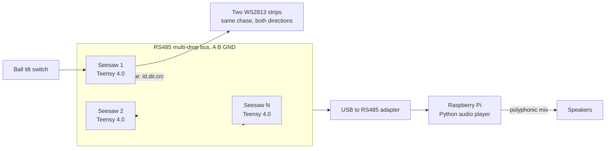
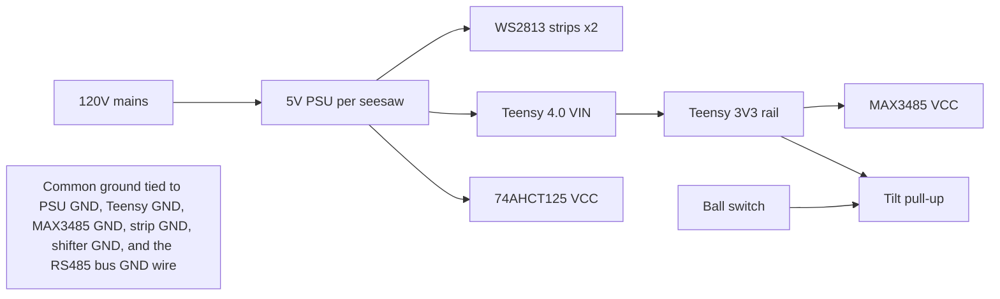

# Seesaws

Distributed control system for an interactive seesaw installation. Each seesaw has a **Teensy 4.0** that detects which side is down via a tilt switch, plays a directional LED chase on two WS2813 strips along its length, and broadcasts the event over an **RS485** bus to a central **Raspberry Pi** that plays a sound. Sounds are polyphonic - they overlap freely instead of cutting each other off.

The system is designed to scale to N seesaws with no architectural changes: every seesaw runs the same firmware, only the `SEESAW_ID` differs per flash, and adding a new seesaw on the Pi side is one entry in `config.yaml`.



## Repo layout

- [Firmware/](Firmware/) - Teensy 4.0 firmware. See [Firmware/README.md](Firmware/README.md).
  - [Seesaw/](Firmware/Seesaw/) - Arduino sketch
  - [tools/csv_to_header.py](Firmware/tools/csv_to_header.py) - converts a chase CSV into `chase.h`
- [Audio/](Audio/) - Pi audio player (Python). See [Audio/README.md](Audio/README.md).

## Behavior

When a seesaw tilts past its threshold, after a 50 ms debounce window:

1. The Teensy sends a 6-byte event frame over RS485 announcing `(SEESAW_ID, direction)`.
2. The Teensy plays the chase animation on both LED strips simultaneously - **forward** for `SIDE_A`, **reverse** for `SIDE_B`. (One CSV; the playback engine reverses index order for the opposite tilt.) A new tilt event interrupts the in-progress chase.
3. The Pi receives the frame, validates the CRC, dedupes against duplicate retransmits, and plays the WAV file mapped to `(seesaw_id, direction)` on a free `pygame.mixer` channel. It does not interrupt sounds already playing.

The Pi is a passive listener; seesaws never wait for an ack. Each event is sent twice on the bus with random jitter to mitigate the rare case of two seesaws tilting simultaneously and colliding on the wire.

## Hardware bill of materials (per seesaw)

- 1x Teensy 4.0
- 1x ball / mercury tilt switch (e.g. SW-520D)
- 1x **MAX3485** or **SN65HVD3082** (3.3 V RS485 transceiver - **do not use the 5 V MAX485 with Teensy 4.0**, its 3.3 V GPIO is not 5 V tolerant)
- 1x 74AHCT125 (or 74HCT245) 5 V level-shifting buffer for the LED data lines
- 2x WS2813 LED strips (length to taste; same length on both sides)
- 1x 5 V PSU sized to your LED count - e.g. Mean Well **LRS-50-5** (10 A) or **LRS-75-5** (15 A). Allow ~60 mA per LED at full white, then 1.5x headroom.
- 2x 1000 uF electrolytic caps (one per strip, across V+/GND at the strip start)
- 2x 330-470 ohm resistors in series with each strip's data line (after the level shifter)

Bus-wide (not per seesaw):

- 2x 120 ohm termination resistors (one at each physical end of the RS485 bus, **not** on every node)
- 2x 680 ohm bias resistors at one node (typically the Pi end), one to 3V3 and one to GND
- 1x USB-to-RS485 adapter for the Pi (any common CH340/FT232+MAX485 dongle works)

## Wiring

### Per-seesaw power tree (5 V local PSU)



Notes:

- **Cut the `VIN/VUSB` solder pad** on the underside of the Teensy 4.0 if you ever plug USB in while the rail is hot. Otherwise USB back-feeds the rail. Standard PJRC procedure for installations.
- **Do not** power the LED strips through the Teensy or its 3V3 regulator. Strips draw amps; they go straight to the PSU output.
- All grounds must be common: PSU GND, Teensy GND, transceiver GND, level shifter GND, both strip GNDs, and the RS485 bus GND wire all tie together.

### LED data path (3.3 V to 5 V)

Teensy 4.0 outputs 3.3 V signals; WS2813 wants `VIH >= 3.5 V` when powered from 5 V. The 74AHCT125 buffer (powered from 5 V) takes the Teensy's 3.3 V outputs and produces clean 5 V edges at the strip data input.

```text
Teensy pin 8  -> 74AHCT125 input  -> 470 ohm -> Strip 1 DIN   (1000 uF cap V+/GND at strip start)
Teensy pin 14 -> 74AHCT125 input  -> 470 ohm -> Strip 2 DIN   (1000 uF cap V+/GND at strip start)
```

### RS485 bus

Run a 3-conductor cable between all nodes: A, B, and a GND reference wire. CAT5 with one twisted pair for A/B and one conductor for GND works perfectly.

- **Termination**: 120 ohm across A-B at both physical ends of the bus only.
- **Biasing**: ~680 ohm A-to-3V3 and ~680 ohm B-to-GND at exactly one node (usually the Pi end).
- **Adapter**: a USB-to-RS485 dongle on the Pi avoids the Pi's 3.3 V GPIO mismatch and Bluetooth UART contention. Recommended.
- **Transceiver wiring** (each Teensy):
  - MAX3485 VCC -> Teensy 3V3
  - MAX3485 GND -> common ground
  - MAX3485 RO  -> Teensy pin 0 (Serial1 RX)
  - MAX3485 DI  -> Teensy pin 1 (Serial1 TX)
  - MAX3485 DE+RE tied together -> Teensy pin 6 (`PIN_RS485_DE`)
  - MAX3485 A/B -> bus A/B

`Serial1.transmitterEnable(PIN_RS485_DE)` toggles the DE/RE pin around every transmission automatically.

## Installation workflow

1. **Wire one seesaw** per the diagrams above. Power it up; the strips should be dark.
2. **Build chase data**. Author the chase animation in your tool of choice and export to CSV (one row per frame, R,G,B,R,G,B,... per LED, 0..255). Convert to a header:
   ```bash
   python Firmware/tools/csv_to_header.py path/to/chase.csv
   ```
   This overwrites `Firmware/Seesaw/chase.h`.
3. **Set the seesaw's ID** by editing `#define SEESAW_ID 1` in `Firmware/Seesaw/config.h`. Use `1` for the first seesaw, `2` for the second, etc.
4. **Flash** with the Arduino IDE + Teensyduino. See [Firmware/README.md](Firmware/README.md) for details.
5. **Tilt the seesaw** - both strips should run the chase forward. Tilt the other way - same chase, in reverse.
6. **Repeat** steps 3-5 for each seesaw, incrementing the ID each time.
7. **Set up the Pi**: install the audio player and copy in your sound assets. See [Audio/README.md](Audio/README.md). Map every `(seesaw_id, direction)` to a WAV file in `Audio/config.yaml`.
8. **Wire the bus** with termination at both ends and biasing at the Pi end. Connect the USB-to-RS485 adapter to the Pi.
9. **Start the audio player** (manually first, then enable the systemd service for autostart on boot).

## Sub-READMEs

- [Firmware/README.md](Firmware/README.md) - Teensyduino setup, library install, pin map, chase paste workflow, tuning constants, troubleshooting.
- [Audio/README.md](Audio/README.md) - Pi setup, USB-RS485 adapter, Python venv, `config.yaml` schema, running manually vs systemd, troubleshooting.

## Defaults

| Setting | Default | Where to change |
|---|---|---|
| Frame rate | 30 FPS | `CHASE_FPS` in `Firmware/Seesaw/config.h` |
| Tilt debounce | 50 ms | `TILT_DEBOUNCE_MS` in `Firmware/Seesaw/config.h` |
| RS485 baud | 115200 | `RS485_BAUD` in firmware AND `serial.baud` in `Audio/config.yaml` |
| Resend count | 2 | `RS485_RESEND_COUNT` in `Firmware/Seesaw/config.h` |
| Polyphony | 32 voices | `audio.channels` in `Audio/config.yaml` |
